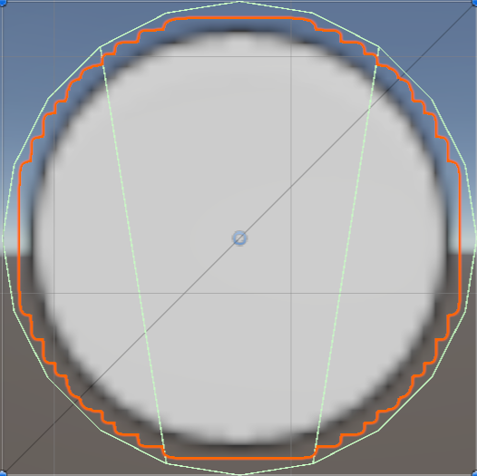
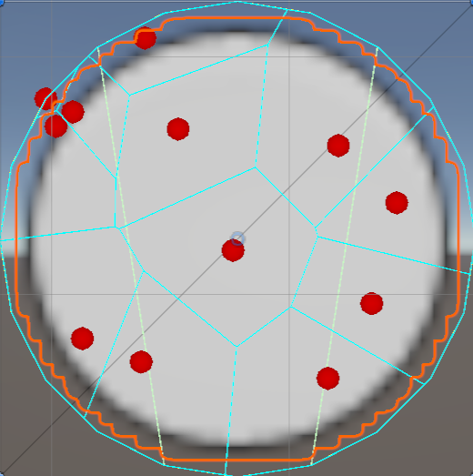

# Voronoi Fracture Application
## Team Members
Serena Akpoyibo, Issac Lee, Galen Sagarin

## Link to Project:

[Link to Voronoi Fractures](https://issacl891.github.io/voronoi-fracture-716/)

## Project Description
This is a application tool that implements Voronoi fractures on a 2D plane in C# and visualizes them using Unity game engine. The application is designed to show the effect of a shape colliding with the surface or another shape.

## Background Information 

## User Interaction
* Wait for collision :- When enabled, it would not display fracture immediately
* Impact Threshold :- Measure of force needed to create fracture
* Break Depth:- Number of times recursively the object can fracture after initial fracture
* Time Rewinder:- Playback of the fracture

**The break depth is capped at 3 because more depth was too computationally heavy.* 

## Implementation and Optimizations

### Inputs and Outputs

Given a collider like

The output would be

As you can see the output is the orginal collider with individual shards made by voronoi cells.

### Breakdown of algorithm
The pipeline works by generating a new set of meshes on the fly from the original object's polygon collider.
 
*   **1st Step: Site Generation** ($N$ points)
    We generate random points inside the specific polygon boundary.

*   **2nd Step: Delaunay Triangulation**
    We use the Bowyer-Watson algorithm to triangulate these sites. This connects the points into a web of triangles that fills the space.

*   **3rd Step: Voronoi Cell Construction**
    We compute the dual of the Delaunay triangulation. For every site, we find the circumcenters of its connected triangles. These circumcenters form the vertices of the Voronoi cell for that site.

*   **4th Step: Clipping**
    The raw Voronoi cells are square-bound. We use the **Vatti clipping algorithm (Clipper2 library)** to intersect these cells with the original object's collider. This crops the cells to the shape of the object.

*   **5th Step: Mesh & Texture Generation**
    *   **Mesh:** We convert the clipped polygons into Unity meshes using ear-clipping triangulation.
    *   **Texture:** We rasterize a new texture for every shard to give it a unique internal color/pattern.

### Complexity
We analyzed the running time of our fracture pipeline.
 
**Variables:**
*   **N**: Number of fracture pieces (fragments)
*   **M**: Number of vertices in the object's collider
*   **T**: Texture resolution (e.g., 512x512)

#### Full Pipeline
**Total Complexity:** $O(N \cdot T^2)$
 
This is the implementation we use, where we generate a unique texture for every shard. The **texture generation** ($T \times T$ loop) dominates all other steps.

**Complexity Reference per Step:**
*   **1. Site Gen:** $O(N \cdot M)$ (Rejection sampling)
*   **2. Triangulation:** $O(N \log N)$ (Bowyer-Watson)
*   **3. Voronoi Construction:** $O(N)$ (Linear graph traversal)
*   **4. Clipping:** $O(N \cdot M \log M)$ (Clipper2 / Vatti's Algorithm)
*   **5. Mesh Gen:** $O(N \cdot M^2)$ (Ear clipping)

*   **6. Texture Gen:** **$O(N \cdot T^2)$** (Software rasterization - **The Bottleneck**)

 

**Impact:** If we have 10 fragments and a 512x512 texture, the texture step performs ~2.6 million operations, completely overshadowing the geometry steps.

While some of these algorithms are not the most efficient, since we are dealing with small inputs the complexity is much less of a concern and often times simple algorithms are faster than complex ones for small inputs. For example our sites are bounded at 30 since anything bigger makes the pieces too small to see anyways. 

### Related Projects

### What are the needs for the problem domain
For this specific problem domain, finding the perfect mathematical solution is often less important than finding a visually plausible and fast one.
*   **Visual Plausibility over Accuracy:** We don't need an accurate solution. Instead, we just need the output to look like shattered glass or stone. Random Voronoi cells achieve this organic look effectively, even if they aren't physically rigorous.
*   **Real-Time Performance:** The algorithm must run in milliseconds to avoid stutter during gameplay. Additionally, since the algorithim is usually ran with small inputs complexity is less of a concern compared to actual testing time.
*   **Robustness:** The algorithm cannot crash, leave holes, or lose volume. By doing so, it would cause the object to look unnatural or break the game.

## References
* [Delaunay to Voronoi Algorithm with Bowyer-Watson Algorithm](https://en.wikipedia.org/wiki/Bowyer%E2%80%93Watson_algorithm?ref=gorillasun.de)
